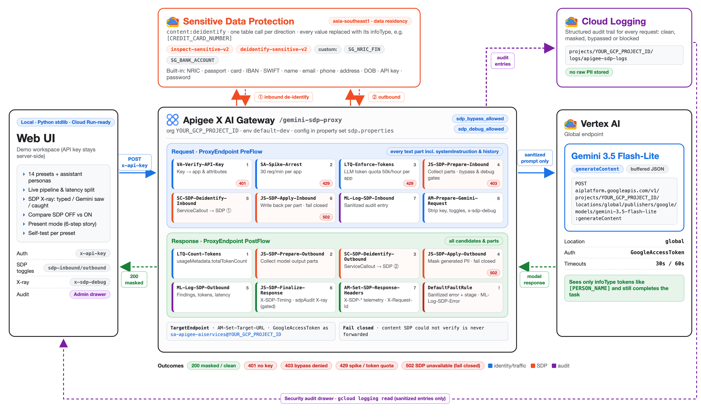
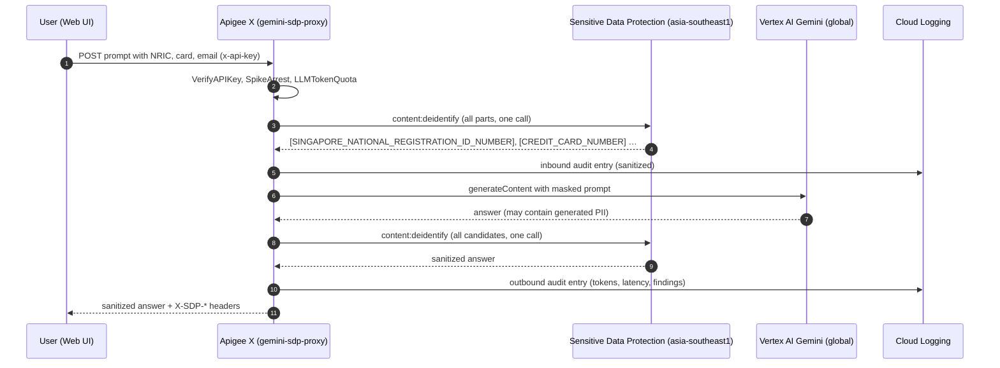
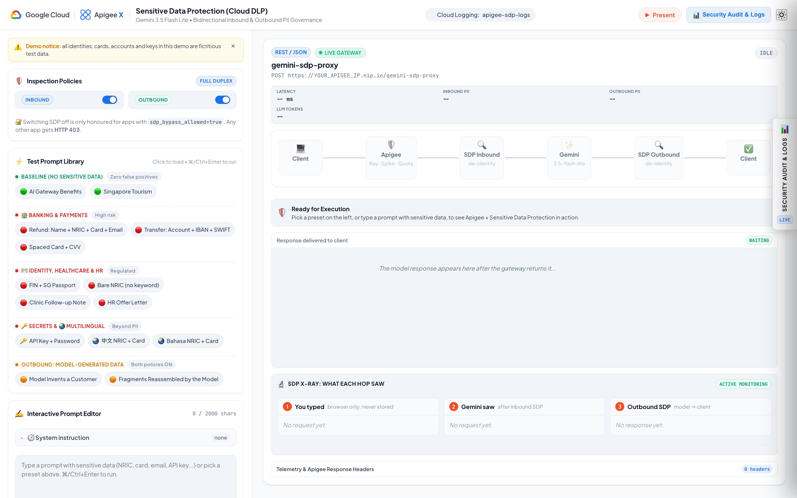

# Apigee X AI Gateway: Sensitive Data Protection for GenAI
### Mask PII before it reaches the model, and again before it reaches the user. Bidirectional Cloud DLP de-identification for Gemini prompts and responses

[](https://cloud.google.com/apigee)
[](https://cloud.google.com/security/products/sensitive-data-protection)
[](https://cloud.google.com/vertex-ai)
[](https://cloud.google.com/logging)
[](https://cloud.google.com/run)
[-3776AB?logo=python&logoColor=white)](https://www.python.org)
[](LICENSE)

---

> [!NOTE]
> ### 💡 AI Gateway reference: sensitive data protection
> This repository shows how **Google Cloud Apigee X** acts as an **AI Gateway** that keeps personal and secret data out of an LLM, **in both directions**.
> Every prompt is de-identified by **Sensitive Data Protection (Cloud DLP)** before it is sent to **Gemini 3.5 Flash-Lite**, and every answer is de-identified again before it goes back to the client. The client app does not change.
>
> It features **one DLP call per direction** covering every text part (system instruction, all turns, all candidates), **fail-closed** policies, **governed bypass** per app, **token quotas**, a structured **Cloud Logging audit trail** with no raw values, and a **web UI** with an *SDP X-ray* that shows exactly what the model saw.

---

## 🎯 Intention & Business Problem

Employees and customer-facing apps paste NRICs, card numbers, bank accounts, medical notes and API keys into AI assistants. Once that text reaches a model endpoint it may be logged, cached or echoed back. Asking every app team to scrub prompts themselves does not scale and is impossible to audit.

```
┌─────────────────────────────────────────────────────────────────────────────┐
│                     THE SENSITIVE DATA IN PROMPTS CHALLENGE                 │
└─────────────────────────────────────────────────────────────────────────────┘

  ❌ WITHOUT A GATEWAY: raw PII goes straight to the model
  ┌──────────────┐   "Refund S1234567D, card 4532 …"   ┌─────────────────────┐
  │  Client app  │ ──────────────────────────────────> │  LLM endpoint       │
  └──────────────┘   raw values in prompts and logs    └─────────────────────┘
  • Exposure: NRIC, card, bank and health data leave your control.
  • Leakage back: the model can repeat, invent or reassemble PII in its answer.
  • Inconsistent: every team writes (or forgets) its own regex scrubber.
  • No evidence: nothing proves what was sent, masked or blocked.

  ─────────────────────────────────────────────────────────────────────────────

  ✅ WITH APIGEE X AS THE AI GATEWAY: SDP on the way in and on the way out
  ┌──────────────┐    prompt with PII     ┌───────────────────────────────────┐
  │  Client app  │ ─────────────────────> │  Apigee X AI Gateway              │
  └──────────────┘   one API, one key     │  SDP inbound → Gemini → SDP out   │
         ▲                                └─────────────────┬─────────────────┘
         │   "Refund [SINGAPORE_NATIONAL_REGISTRATION_ID_NUMBER] …"   │
         └──────────────────────────────────────────────────┘
  • Protected: Gemini only ever sees [INFOTYPE] placeholders.
  • Bidirectional: outbound SDP catches data the model generates or rebuilds.
  • Central policy: DLP templates are code; change them once for every app.
  • Auditable: every request writes sanitized, structured Cloud Logging entries.
```

### Key Architectural Capabilities Demonstrated

1. **Inbound de-identification**:
   * Apigee collects **every** text part (`systemInstruction` and all `contents` turns) and sends them to DLP `content:deidentify` in **one** `ServiceCallout` as a table (one row per part), then writes each sanitized row back to its own part.
2. **Outbound de-identification**:
   * The model's answer is de-identified again across **all** candidates and parts, so PII the model invents or reassembles from fragments never reaches the client.
3. **Fail closed**:
   * If DLP is unreachable, returns an error or an unexpected shape, the request is blocked with `502 SDP_UNAVAILABLE`. Unverified text is never forwarded.
4. **Governed bypass and X-ray**:
   * Only apps with the attribute `sdp_bypass_allowed=true` may switch SDP off; every other app gets `403`. Only apps with `sdp_debug_allowed=true` may request the `sdpAudit` X-ray.
5. **Gateway controls for GenAI**:
   * API key, SpikeArrest (30 req/min) and `LLMTokenQuota` (50k tokens/hour per app, counted from `usageMetadata`).
6. **Audit and observability**:
   * `MessageLogging` writes a sanitized entry for every request (clean, masked, bypassed or blocked) to the Cloud Logging log `apigee-sdp-logs`. Responses carry `X-SDP-*` telemetry and per-hop timings.

---

## 🏛️ High-Level Architecture

<p align="center">
  
</p>

<sub>Source: <a href="docs/architecture-diagram.html">docs/architecture-diagram.html</a>, rendered with <a href="docs/render-architecture.sh">docs/render-architecture.sh</a> (headless Chrome)</sub>

### Request flow inside the proxy

```mermaid
flowchart LR
    C([Client]) --> VA[VA-Verify-API-Key] --> SA[SA-Spike-Arrest] --> LTQ[LTQ-Enforce-Tokens]
    LTQ --> PI[JS-SDP-Prepare-Inbound]
    PI -- "bypass requested, app not allowed" --> F403[/403 PERMISSION_DENIED/]
    PI --> SCI[SC-SDP-Deidentify-Inbound<br/>DLP content:deidentify]
    SCI --> AI[JS-SDP-Apply-Inbound]
    AI -- "DLP failed" --> F502[/502 SDP_UNAVAILABLE/]
    AI --> MLI[ML-Log-SDP-Inbound] --> G[Vertex AI global<br/>gemini-3.5-flash-lite]
    G --> CT[LTQ-Count-Tokens] --> SCO[SC-SDP-Deidentify-Outbound] --> AO[JS-SDP-Apply-Outbound]
    AO -- "DLP failed" --> F502
    AO --> MLO[ML-Log-SDP-Outbound] --> FIN[JS-SDP-Finalize-Response<br/>X-SDP-* headers, optional sdpAudit] --> C2([Client])
```



### End-to-end sequence



---

## 🔒 Sensitive Data Protection Configuration

| Setting | Value |
| :--- | :--- |
| Location | `asia-southeast1` (Singapore). PII is masked here **before** the prompt reaches the Vertex AI `global` endpoint. |
| Inspect template | `inspect-sensitive-v2` from [dlp/inspect-sensitive-v2.json](dlp/inspect-sensitive-v2.json) |
| De-identify template | `deidentify-sensitive-v2` from [dlp/deidentify-sensitive-v2.json](dlp/deidentify-sensitive-v2.json): `replaceWithInfoTypeConfig` for every infoType |
| Applied by | [setup-dlp-templates.sh](setup-dlp-templates.sh) (idempotent create or update) |

### Detected infoTypes

| Category | infoTypes |
| :--- | :--- |
| Singapore identity | `SINGAPORE_NATIONAL_REGISTRATION_ID_NUMBER`, `SINGAPORE_PASSPORT`, `PASSPORT`, custom `SG_NRIC_FIN` (regex `\b[STFGM]\d{7}[A-Z]\b`, catches IDs typed without the word "NRIC") |
| Payments and banking | `CREDIT_CARD_NUMBER`, `CREDIT_CARD_DATA`, `CREDIT_CARD_TRACK_NUMBER`, `IBAN_CODE`, `SWIFT_CODE`, custom `SG_BANK_ACCOUNT` (`\b\d{3}-\d{5,6}-\d{1,3}\b`, boosted by hotwords such as account, DBS, OCBC, UOB) |
| Personal | `PERSON_NAME`, `EMAIL_ADDRESS`, `PHONE_NUMBER`, `STREET_ADDRESS`, `DATE_OF_BIRTH` |
| Secrets | `GCP_API_KEY`, `GCP_CREDENTIALS`, `AUTH_TOKEN`, `PASSWORD` |

Examples: `S1234567D` → `[SINGAPORE_NATIONAL_REGISTRATION_ID_NUMBER]`, a bare `S1234567D` → `[SG_NRIC_FIN]`, `weiming.tan@example.com` → `[EMAIL_ADDRESS]`, `012-345678-9` (DBS) → `[SG_BANK_ACCOUNT]`.

> [!TIP]
> **Rollback:** the original `inspect-sensitve` / `deidentify-sensitve` templates are untouched. Swap the two template lines in [sdp.properties](gemini-sdp-proxy/apiproxy/resources/properties/sdp.properties) (the old values are commented there) and redeploy.

**Known limits:** multi-token names can become `[PERSON_NAME] [PERSON_NAME]`; OAuth `ya29.` tokens are not reliably detected; card numbers must pass the Luhn check.

---

## 🧱 Proxy Execution Pipeline

| Direction | Policy | Type | Purpose |
| :--- | :--- | :--- | :--- |
| **Inbound** | `VA-Verify-API-Key` | VerifyAPIKey | Validates `x-api-key`, resolves the app and its attributes |
| **Inbound** | `SA-Spike-Arrest` | SpikeArrest | 30 requests/minute per app |
| **Inbound** | `LTQ-Enforce-Tokens` | LLMTokenQuota | Enforces 50k tokens/hour per app |
| **Inbound** | `JS-SDP-Prepare-Inbound` | JavaScript | Gated bypass toggles, normalises the request, collects every text part, builds the DLP table |
| **Inbound** | `RF-SDP-Bypass-Forbidden` | RaiseFault | *(Conditional)* 403 when a restricted app tries to switch SDP off |
| **Inbound** | `SC-SDP-Deidentify-Inbound` | ServiceCallout | One DLP `content:deidentify` call; findings come from `transformationSummaries` |
| **Inbound** | `JS-SDP-Apply-Inbound` | JavaScript | Validates the DLP response and writes each sanitized row back to its part |
| **Inbound** | `RF-SDP-Unavailable` | RaiseFault | *(Conditional)* Fail closed: 502 if SDP could not verify the content |
| **Inbound** | `ML-Log-SDP-Inbound` | MessageLogging | Audit entry for **every** request |
| **Inbound** | `AM-Prepare-Gemini-Request` | AssignMessage | Strips client credentials and toggle headers |
| **Backend** | `AM-Set-Target-URL` + `TargetEndpoint` | AssignMessage / HTTPTarget | Vertex AI URL from the `sdp` property set; Google OAuth token |
| **Outbound** | `LTQ-Count-Tokens` | LLMTokenQuota | Counts `usageMetadata.totalTokenCount` |
| **Outbound** | `JS-SDP-Prepare-Outbound` | JavaScript | Collects text parts across **all** candidates; fails closed on non-JSON |
| **Outbound** | `SC-SDP-Deidentify-Outbound` | ServiceCallout | One DLP `content:deidentify` call on the model output |
| **Outbound** | `JS-SDP-Apply-Outbound` | JavaScript | Validates and writes sanitized text back per part |
| **Outbound** | `RF-SDP-Unavailable` | RaiseFault | *(Conditional)* Fail closed |
| **Outbound** | `ML-Log-SDP-Outbound` | MessageLogging | Audit entry including token usage and model latency |
| **Outbound** | `JS-SDP-Finalize-Response` | JavaScript | Builds `X-SDP-Timing`; injects `sdpAudit` only for debug-enabled apps |
| **Outbound** | `AM-Set-SDP-Response-Headers` | AssignMessage | `X-SDP-*` telemetry and `X-Request-Id` |
| **Fault** | `JS-Build-Error-Response` → `ML-Log-SDP-Error` → `AM-Set-Error-Response` | DefaultFaultRule | Sanitized error JSON (never echoes upstream bodies), audit of blocked requests |

Shared JavaScript lives in [sdp-common.js](gemini-sdp-proxy/apiproxy/resources/jsc/sdp-common.js) (included via `<IncludeURL>`). Project, region, templates and model are set in [sdp.properties](gemini-sdp-proxy/apiproxy/resources/properties/sdp.properties), not in policies.

### Consumer apps

| App | `sdp_bypass_allowed` | `sdp_debug_allowed` | Behaviour |
| :--- | :--- | :--- | :--- |
| `sdp-demo-webui` | `true` | `true` | May switch SDP off (`sdp-inbound: false` / `sdp-outbound: false`) and may request the X-ray (`x-sdp-debug: true`) |
| `sdp-demo-restricted` | *(unset)* | *(unset)* | SDP always enforced; bypass attempts return **403 PERMISSION_DENIED**; `x-sdp-debug` is ignored (`X-SDP-Debug: denied`) |

---

## 🔌 API Reference

Base path: `https://<your-apigee-host>/gemini-sdp-proxy`

| Method | Path | Purpose |
| :--- | :--- | :--- |
| POST | `/` | Gemini-native `generateContent` body (`contents`, optional `systemInstruction`, `generationConfig`). Returns the Gemini response with every text part de-identified |

| Request header | Meaning |
| :--- | :--- |
| `x-api-key` | Apigee app key (required) |
| `sdp-inbound: false` / `sdp-outbound: false` | Switch one direction off (also accepted as a query parameter or body field). Honoured only for apps with `sdp_bypass_allowed=true`, otherwise 403 |
| `x-sdp-debug: true` | Adds the `sdpAudit` X-ray to the body. Honoured only for apps with `sdp_debug_allowed=true`; stripped before the call to Vertex AI |

| Response header | Meaning |
| :--- | :--- |
| `X-SDP-{Inbound,Outbound}-Policy-Enabled` | Whether SDP ran in that direction |
| `X-SDP-{Inbound,Outbound}-Sensitive-Data-Detected` / `-Findings-Count` / `-Finding-Types` | What SDP found (infoType names only) |
| `X-SDP-Inbound-Parts-Inspected` | Number of text parts sent to DLP |
| `X-SDP-Timing` | `gateway=..;dlp_in=..;model=..;dlp_out=..;total=..` in ms |
| `X-SDP-Model` | The backend model |
| `X-SDP-Debug` | `enabled`, `denied` or `off` |
| `X-Request-Id` | Correlates the response with its Cloud Logging entries |

The `sdpAudit` object contains the exact (sanitized) parts Gemini received, with roles, plus findings per direction, templates and timings. Raw values are never included. Error bodies include `error.stage` (`gateway`, `sdp_in`, `model`, `sdp_out`).

Example:

```bash
curl -s -X POST "https://<your-apigee-host>/gemini-sdp-proxy" \
  -H "x-api-key: $APIGEE_API_KEY" -H "Content-Type: application/json" \
  -d '{"contents":[{"role":"user","parts":[{"text":"Verify customer: NRIC S9876543A, passport K1234567Z, card 4532015112830366. Summarise."}]}]}'
# "Verify customer: NRIC [SINGAPORE_NATIONAL_REGISTRATION_ID_NUMBER], passport [PASSPORT], card [CREDIT_CARD_NUMBER] …"
```

---

## 🖥️ Demonstration Web UI

<p align="center">
  
</p>

### UI Capabilities & Highlights

* **Test Prompt Library (14 presets)**: baseline (no false positives), banking (refund, transfer with IBAN/SWIFT, spaced card + CVV), identity (FIN + passport, bare NRIC), clinic note, HR offer, developer secrets, Chinese and Malay prompts, and two outbound stories. Business presets carry an assistant persona (sent as `systemInstruction` and inspected too) so Gemini completes the task on masked data. Every preset has a **self-test** badge for its expected infoTypes.
* **Live pipeline**: Client → Apigee → SDP In → Gemini → SDP Out → Client, with per-hop timings and a latency bar showing SDP's share.
* **SDP X-ray**: three columns: what you typed (PII highlighted), what Gemini actually saw (with system/user roles) and what outbound SDP caught, plus a Cloud Logging deep link per request.
* **Compare OFF vs ON**: runs the same prompt twice in parallel and shows the unprotected and protected result side by side.
* **Present mode**: a 6-step guided story (← → to navigate, Enter runs, Esc exits).
* **Security Audit & Logs drawer**: syncs with Cloud Logging (`apigee-sdp-logs`), with KPI cards and filters.
* **Dual theme** (light and dark) and a resizable splitter.
* **BFF pattern**: the API key stays in the Python process and never reaches the browser. Raw prompts are never persisted; the local audit store keeps sanitized text only. Locally the server binds to `127.0.0.1`; on Cloud Run it sits behind IAP and reads the key from Secret Manager. Python 3 standard library only (`ThreadingHTTPServer`), no pip dependencies.

---

## 📁 Repository Structure

```
apigee-sdp-demo/
├── gemini-sdp-proxy/apiproxy/             # The Apigee X proxy (AI gateway)
│   ├── proxies/default.xml                # PreFlow / PostFlow / DefaultFaultRule
│   ├── targets/default.xml                # Vertex AI target with Google OAuth
│   ├── policies/                          # VerifyAPIKey, SpikeArrest, LLMTokenQuota, ServiceCallouts, MessageLogging...
│   └── resources/
│       ├── jsc/                           # prepare / apply (in + out), finalize, error builder, sdp-common.js
│       └── properties/sdp.properties      # DLP project, region, templates; Vertex project, location, model
│
├── dlp/                                   # DLP v2 inspect and de-identify templates (JSON)
│
├── WebUI/                                 # Demo web app (Python 3, zero dependencies)
│   ├── app.py                             # BFF: holds the API key, proxies to Apigee, reads Cloud Logging
│   ├── run-ui.sh                          # loads WebUI/.env and starts the server locally
│   ├── Dockerfile                         # container image for Cloud Run (python:3.11-slim, non-root)
│   ├── deploy-cloudrun.sh                 # deploys the UI to Cloud Run behind IAP (+ custom domain)
│   └── static/                            # index.html, app.js, style.css, demo-v2.css, assets/
│
├── docs/                                  # architecture diagram source (HTML), renderer, screenshot
│
├── setup-dlp-templates.sh                 # creates / updates the DLP v2 templates
├── setup-apigee-resources.sh              # API product, developer, apps + attributes, WebUI/.env
├── deploy.sh                              # uploads and deploys gemini-sdp-proxy
└── test-demo.sh                           # end-to-end regression suite (41 checks)
```

---

## 🛠️ Prerequisites & Technology Stack

### 1. Google Cloud services

| Product / Service | Role in this demo | Notes |
| :--- | :--- | :--- |
| **Apigee X** | AI gateway: auth, rate limiting, token quota, SDP orchestration, audit, telemetry | Apigee X org with an environment attached to an environment group and external ingress |
| **Sensitive Data Protection (Cloud DLP)** | Inspects and de-identifies prompts and responses | Regional templates in `asia-southeast1` |
| **Vertex AI** | Gemini 3.5 Flash-Lite on the `global` endpoint | |
| **Cloud Logging** | Audit trail (`apigee-sdp-logs`) from `MessageLogging` | Read by the web UI's audit drawer |
| **IAM** | Proxy runtime service account | `roles/aiplatform.user`, `roles/dlp.user`, `roles/logging.logWriter` |
| **Cloud Run + IAP + Secret Manager** | Optional hosting for the web UI | Dedicated runtime SA with `roles/logging.viewer` |

### 2. Workstation tools

* **Google Cloud SDK** (`gcloud`), authenticated. Apigee and Vertex AI reject the plain gcloud user token, so the scripts use Application Default Credentials:
  ```bash
  gcloud auth login
  gcloud auth application-default login
  ```
* **apigeecli**:
  ```bash
  curl -s https://raw.githubusercontent.com/apigee/apigeecli/main/downloadLatest.sh | bash
  export PATH=$PATH:$HOME/.apigeecli/bin
  ```
* **curl**, **Python 3** (web UI and tests) and **Google Chrome** (optional, only to re-render the architecture diagram with `docs/render-architecture.sh`).

---

## 🚀 Step-by-Step Setup & Deployment Guide

> [!IMPORTANT]
> Environment-specific values in this repo (project id, Apigee host IP, service account, email) are placeholders that start with `YOUR_`. Search the repo for `YOUR_` and replace them with your own values, or override them with the environment variables below.

### Step 1: Set environment variables

```bash
export PROJECT_ID="your-project-id"
export APIGEE_ORG="$PROJECT_ID"                 # Apigee org (usually the project id)
export APIGEE_ENV="your-apigee-env"
export APIGEE_HOST="your-apigee-host"           # e.g. YOUR_APIGEE_IP_2.nip.io
export APIGEE_RUNTIME_SA="apigee-sdp@$PROJECT_ID.iam.gserviceaccount.com"
gcloud config set project "$PROJECT_ID"
gcloud services enable apigee.googleapis.com dlp.googleapis.com aiplatform.googleapis.com logging.googleapis.com
```

### Step 2: Create the proxy runtime service account

```bash
gcloud iam service-accounts create apigee-sdp --display-name "Apigee SDP gateway"
for r in roles/aiplatform.user roles/dlp.user roles/logging.logWriter; do
  gcloud projects add-iam-policy-binding "$PROJECT_ID" --member "serviceAccount:$APIGEE_RUNTIME_SA" --role "$r"
done
```

### Step 3: Create the DLP templates

```bash
DLP_PROJECT=$PROJECT_ID DLP_LOCATION=asia-southeast1 ./setup-dlp-templates.sh
```

### Step 4: Configure and deploy the proxy

1. Set `dlp_project`, `dlp_location`, the two template names, `vertex_project` and `model` in [sdp.properties](gemini-sdp-proxy/apiproxy/resources/properties/sdp.properties).
2. Upload and deploy with the runtime service account:
   ```bash
   ./deploy.sh
   ```

### Step 5: Create the API product and apps

```bash
./setup-apigee-resources.sh
```

It creates `sdp-demo-product`, the developer `sdp-demo@example.com`, the apps `sdp-demo-webui` (bypass + X-ray allowed) and `sdp-demo-restricted`, writes the web UI key to `WebUI/.env` (gitignored, mode 600) and prints both keys.

### Step 6: Run the regression suite

```bash
./test-demo.sh
```

41 checks: 401 without a key, clean and PII prompts, multi-turn + `systemInstruction` masking, outbound masking, bypass denied (403) vs allowed, v2 detector coverage (name, email, bare NRIC, SG bank account, IBAN, SWIFT, API key), X-ray gating per app, `X-SDP-Timing` format, `error.stage`, and a complete Cloud Logging audit trail with no raw PII.

> [!TIP]
> SpikeArrest allows 30 requests/minute per app. Wait about 30 seconds after heavy manual testing before running the suite.

### Step 7a: Launch the web UI locally

```bash
./WebUI/run-ui.sh
# open http://localhost:8080 (or 8081 if 8080 is busy)
```

### Step 7b (optional): Deploy the web UI to Cloud Run behind IAP

[deploy-cloudrun.sh](WebUI/deploy-cloudrun.sh) builds the UI from source and deploys it as a private Cloud Run service protected by [IAP for Cloud Run](https://cloud.google.com/run/docs/securing/identity-aware-proxy-cloud-run):

```bash
PROJECT=$PROJECT_ID REGION=asia-southeast1 SERVICE=apigee-sdp-demo-ui \
IAP_MEMBER="domain:example.com" DOMAIN=sdp.example.com DNS_ZONE=your-zone \
APIGEE_PROXY_URL="https://$APIGEE_HOST/gemini-sdp-proxy" \
  ./WebUI/deploy-cloudrun.sh
```

What the script does (it is idempotent, so you can safely re-run it):

1. Enables the Cloud Run, IAP, Secret Manager, Cloud Build, Artifact Registry and Logging APIs.
2. Creates a dedicated runtime service account (named after the service) with `roles/logging.viewer` for the audit drawer.
3. Stores `APIGEE_API_KEY` from `WebUI/.env` in the Secret Manager secret `<service>-apigee-api-key` (a new version only if it changed) and lets the runtime SA read it.
4. Runs `gcloud run deploy --source … --iap --no-allow-unauthenticated` with the key injected from Secret Manager (1 vCPU, 512 MiB, scales to zero, max 1 instance).
5. Grants `roles/run.invoker` to the IAP service agent and `roles/iap.httpsResourceAccessor` to `IAP_MEMBER` (a user, group or `domain:`).
6. If `DOMAIN` is set, creates a [Cloud Run domain mapping](https://cloud.google.com/run/docs/mapping-custom-domains) and a `CNAME` to `ghs.googlehosted.com.` in the Cloud DNS zone `DNS_ZONE`. Set `DOMAIN=` to skip.

The domain must be verified for your account (`gcloud domains verify example.com`). IAP applies to the custom domain too, and the managed certificate usually takes 15–60 minutes:

```bash
gcloud beta run domain-mappings describe --domain sdp.example.com --region asia-southeast1
```

To manage who can open the UI later:

```bash
gcloud iap web add-iam-policy-binding --resource-type=cloud-run --service=apigee-sdp-demo-ui \
  --region=asia-southeast1 --member="user:colleague@example.com" --role=roles/iap.httpsResourceAccessor
gcloud iap web get-iam-policy --resource-type=cloud-run --service=apigee-sdp-demo-ui --region=asia-southeast1
```

> [!NOTE]
> Unauthenticated requests are redirected to Google sign-in, and signed-in users who are not allowed get a 403.

### Step 8: Query the audit trail

```bash
gcloud logging read 'logName="projects/'"$PROJECT_ID"'/logs/apigee-sdp-logs"' --limit=5 --format=json
```

---

## 🎭 Demonstration Scenarios

Click **▶ Present** in the UI to walk through these in order.

### Scenario 1: Baseline, a clean prompt
Pick **AI Gateway Benefits**. Nothing is masked, and the pipeline shows SDP adds only tens of milliseconds around the Gemini call.

### Scenario 2: Sensitive data never reaches the model
Pick **Refund: Name + NRIC + Card + Email**. Name, NRIC, card and email are replaced at the gateway. The X-ray shows exactly what Gemini received, and it still completes the refund.

### Scenario 3: With vs without the gateway
Same preset, click **Compare OFF vs ON**. Only the privileged demo app may switch SDP off; every other app gets HTTP 403.

### Scenario 4: Catching what the model rebuilds
Pick **Fragments Reassembled by the Model**. The card number and NRIC arrive as harmless-looking fragments, so inbound SDP has nothing to mask. Gemini stitches them together, and outbound SDP catches them before they reach the client.

### Scenario 5: Beyond PII, developer secrets
Pick **API Key + Password**. The Google API key and password are stripped before the prompt leaves the gateway.

### Scenario 6: Every decision is audited
Open **Security Audit & Logs**. Each request wrote sanitized, structured entries to Cloud Logging. No raw values are stored anywhere.

---

## 🔐 Security Notes

* API key + SpikeArrest + `LLMTokenQuota` on every call. Bypass and X-ray rights come from **app attributes**, never from client headers alone.
* **Fail closed** in both directions: no DLP verdict, no forwarding.
* Client credentials and toggle headers (`x-api-key`, `sdp-inbound`, `sdp-outbound`, `x-sdp-debug`) are removed before the call to Vertex AI.
* Sanitized error bodies (never echo upstream bodies) with an `error.stage` for troubleshooting.
* Audit entries and the X-ray contain infoType names and sanitized text only, never raw values.
* Hosted web UI: Cloud Run with IAP and `--no-allow-unauthenticated`; the Apigee key sits in Secret Manager and only a dedicated runtime SA can read it; the container runs as non-root. TLS to the gateway is verified (set `APIGEE_TLS_INSECURE=1` only for a self-signed lab host).
* **Production to-dos:** add Model Armor for prompt injection and jailbreak detection (covered in a separate demo), and consider reversible tokenization (KMS-wrapped keys) if the business needs to re-identify values downstream.

---

## 🧹 Teardown & Resource Cleanup

```bash
A="apigeecli --default-token -o $APIGEE_ORG"
$A apis undeploy -n gemini-sdp-proxy -e "$APIGEE_ENV"
$A developers delete -n sdp-demo@example.com        # also deletes its apps
$A products delete -n sdp-demo-product
$A apis delete -n gemini-sdp-proxy

TOKEN=$(gcloud auth application-default print-access-token)
BASE="https://dlp.googleapis.com/v2/projects/$PROJECT_ID/locations/asia-southeast1"
curl -s -X DELETE -H "Authorization: Bearer $TOKEN" "$BASE/inspectTemplates/inspect-sensitive-v2"
curl -s -X DELETE -H "Authorization: Bearer $TOKEN" "$BASE/deidentifyTemplates/deidentify-sensitive-v2"

# hosted web UI (Step 7b); deleting the service also removes its IAP bindings
gcloud run services delete apigee-sdp-demo-ui --region asia-southeast1 --quiet
gcloud secrets delete apigee-sdp-demo-ui-apigee-api-key --quiet
gcloud iam service-accounts delete "apigee-sdp-demo-ui@$PROJECT_ID.iam.gserviceaccount.com" --quiet
# if you used DOMAIN
gcloud beta run domain-mappings delete --domain sdp.example.com --region asia-southeast1 --quiet
gcloud dns record-sets delete sdp.example.com. --zone your-zone --type CNAME
```

> [!CAUTION]
> These commands delete resources permanently. Audit entries already written to Cloud Logging stay until the log bucket's retention period expires.

---

## 📚 Additional Resources

* [Apigee X documentation](https://cloud.google.com/apigee/docs)
* [Apigee ServiceCallout policy](https://cloud.google.com/apigee/docs/api-platform/reference/policies/service-callout-policy)
* [Apigee LLMTokenQuota policy](https://cloud.google.com/apigee/docs/api-platform/reference/policies/llm-token-quota-policy)
* [Sensitive Data Protection: de-identifying text](https://cloud.google.com/sensitive-data-protection/docs/deidentify-sensitive-data)
* [Sensitive Data Protection infoType reference](https://cloud.google.com/sensitive-data-protection/docs/infotypes-reference)
* [Vertex AI Gemini API](https://cloud.google.com/vertex-ai/generative-ai/docs/model-reference/inference)
* [apigeecli](https://github.com/apigee/apigeecli)

---

## 📄 License

Licensed under the [Apache License 2.0](LICENSE).

> [!NOTE]
> This is a demo, not an official Google product. All identities, cards, accounts and keys in the presets are fictitious test data.
